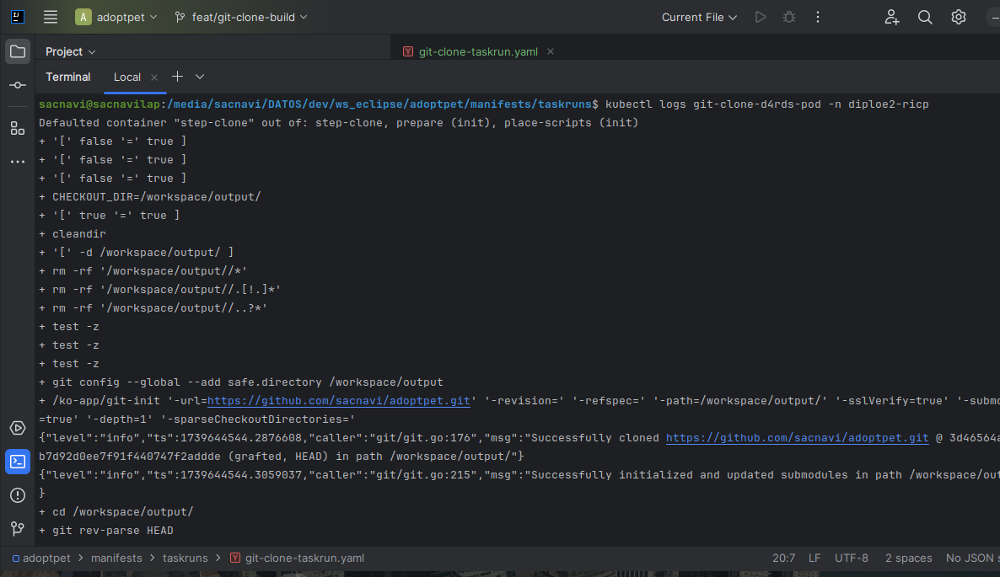
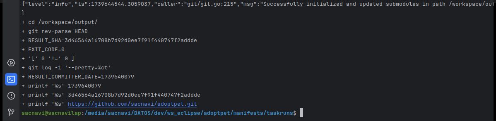
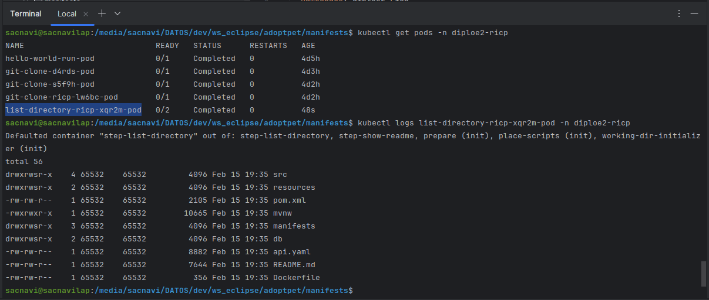
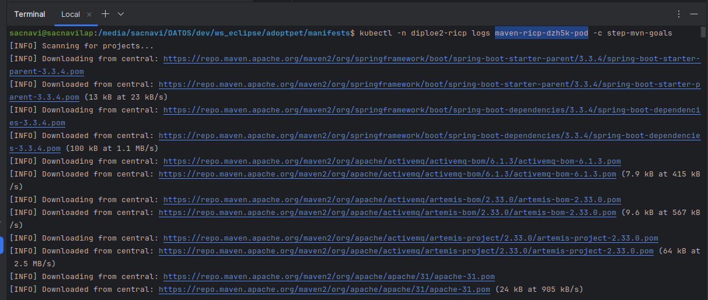
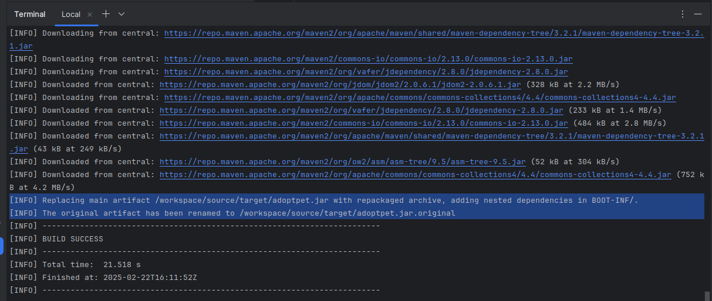
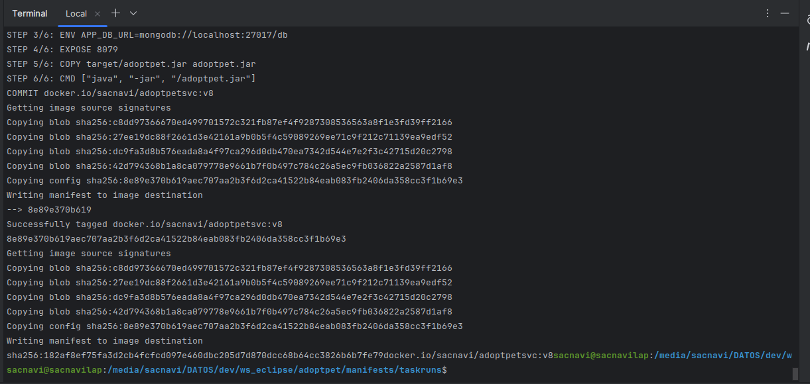
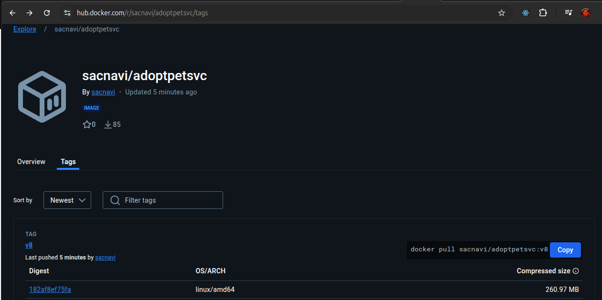
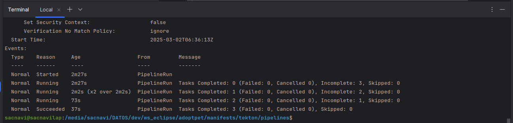

# Adoptpet - CI/CD
Readme file at project directory shows how to build and deploy this project in different environments.

This document describes how to move to automatic builds and deployments.

During the course this project was developed for, several tools and platforms have been used.

For continuous integration stages, Tekton framework tasks were installed and run on a Kubernetes cluster.

# Continuous Integration
It is necessary to integrate changes to code as soon as possible, to validate that they are correct and 
code can be compiled and tested and to be able to build all artifacts.

In order to achieve it, a pipeline should be created to perform a series of tasks to complete all steps.

## Steps
There are some activities to perform so cluster gets ready to start working and as part of the actual process.

### Prepare cluster
First step is to create an account with privileges to handle tasks and runners, get persistent volumes 
and secrets or config maps available. 

For these exercises, a cluster was set up and client configured so we could work on it,
[***namespaces***](https://kubernetes.io/docs/concepts/overview/working-with-objects/namespaces/) were also created
in advance. All this is beyond the scope of this document.

#### Secret
A [***secret***](https://kubernetes.io/docs/concepts/configuration/secret/) is an object that contains a small
amount of sensitive data such as a password, a token, or a key.

A secret for image registry (Docker in this case) is necessary so cluster can access it and pull/push images on behalf
of the user owner of that account.
```yaml
apiVersion: v1
kind: Secret
metadata:
  name: dockerconfig-secret # this name is required for certain task, it will be used later
  namespace: <namespace-name>
stringData:
  config.json: | # this is the content of file config.json at ~/.docker and generated after logging in to docker.
    {
      "auths": {
        "<image-registry-url>": {
          "auth": "<token-for-image-registry>"
        }
      }
    }
```

#### Service account
A [***service account***](https://kubernetes.io/docs/tasks/configure-pod-container/configure-service-account/) provides an identity for processes that run in a Pod, and maps to a ServiceAccount object.
There is always at least one ServiceAccount in each namespace.

A simple service account can be created applying against cluster this manifest
```yaml
apiVersion: v1
kind: ServiceAccount
metadata:
 name: <service-account-name> # this name will be used during role binding (see below)
 namespace: <namespace-name>
```
to enable it to use the secret previously created, these lines should be added at the end.
```yaml
imagePullSecrets:
  - name: dockerconfig-secret # this is the name assigned to secret  before
secrets:
  - name: dockerconfig-secret
```

#### Role
Role-based access control ([***RBAC***](https://kubernetes.io/docs/reference/access-authn-authz/rbac))
is a method of regulating access to computer or network resources.

A [***role***](https://kubernetes.io/docs/reference/access-authn-authz/rbac/#kubectl-create-role) contains rules that
represent a set of permissions, these are purely additive, there are no "deny" rules (whitelisting vs blacklisting).

A role always sets permissions within a particular namespace.

```yaml
apiVersion: rbac.authorization.k8s.io/v1
kind: Role
metadata:
  name: <role-name> # this name will be used during role binding (see below)
  namespace: <namespace-name>
rules:
- apiGroups: [""] # role is allowed to access only api groups listed
  resources: ["pods", "persistentvolumeclaims", "secrets", "configmaps"] # role is allowed to access only resources added
  verbs: ["get", "list", "watch", "create", "update", "delete"] # role is allowed to execute only actions added
- apiGroups: ["tekton.dev"] # this means that api group, resource or action not listed is not allowed for this role
  resources: ["pipelineruns", "taskruns"]
  verbs: ["get", "list", "watch", "create", "update", "delete"]
```

Once role and service account are created, it is necessary to associate them so cluster knows that account is granted 
those privileges.
[***Role binding***](https://kubernetes.io/docs/reference/access-authn-authz/rbac/#kubectl-create-rolebinding)
should be applied as listed below.

```yaml
apiVersion: rbac.authorization.k8s.io/v1
kind: RoleBinding
metadata:
  name: <rolebinding-name> # name for this object (RoleBinding)
  namespace: <namespace-name>
subjects:
  - kind: ServiceAccount
    name: <service-account-name> # name created before
    namespace: <namespace-name>
roleRef:
  kind: Role
  name: <role-name> # name created before
  apiGroup: rbac.authorization.k8s.io
```

#### Persistent volume
A persistent volume ([***PV***](https://kubernetes.io/docs/concepts/storage/persistent-volumes/))
is a piece of storage in the cluster that has been provisioned by an administrator or dynamically.
A persistent volume claim (PVC) is a request for that storage by a user.

This process will require resources to store source code, compiled code and docker images, so a PVC should be created 
so generated pods can use it.

```yaml
apiVersion: v1
kind: PersistentVolumeClaim
metadata:
  name: <workspace-name>
  namespace: <namespace-name>
spec:
  accessModes:
    - ReadWriteOnce # can be mounted as read-write by a single node
  resources:
    requests:
      storage: 1Gi # should be enough for this process requirements
```

#### Maven config map
A [***config map***](https://kubernetes.io/docs/concepts/configuration/configmap/)
is an object used to store non-confidential data in key-value pairs.
Pods can consume config maps as environment variables, command-line arguments, or as configuration files in a volume.

A config map allows to decouple environment-specific configuration from container images,
so that applications are easily portable.

This project is built and run using Apache Maven, maven task detailed later needs a particular config map to exist,
where value is the content of `settings.xml` file, empty sections are shown here, but in real projects different
servers (nexus, jfrog, etc.), proxies, profiles and so on, should be informed instead.

It can be generated using: 

```yaml
apiVersion: v1
kind: ConfigMap
metadata:
  name: maven-settings # this name is specific for maven task, so it has to be exactly the same
data:
  settings.xml: | 
    <settings xmlns="http://maven.apache.org/SETTINGS/1.0.0" 
              xmlns:xsi="http://www.w3.org/2001/XMLSchema-instance"
              xsi:schemaLocation="http://maven.apache.org/SETTINGS/1.0.0 http://maven.apache.org/xsd/settings-1.0.0.xsd">
      <pluginGroups>
        <!-- pluginGroup -->
      </pluginGroups>

      <proxies>
        <!-- proxy -->
      </proxies>

      <servers>
        <!-- server -->
      </servers>

      <mirrors>
        <!-- mirror -->
      </mirrors>

      <profiles>
        <!-- profile -->
      </profiles>
    </settings>
```

All these snippets have to be written into single `*.yaml` files and then applied against cluster (replacing names)

`kubectl apply -f <object-name>.yaml -n <namespace-name>`

output just shows object creation confirmation or error messages.

`<object-type>/<object-name> [created|configured|changed]`

last resource created should show this message

`<configmap>/<maven-settings> created`

From this point on focus goes to specific tasks related to project building.

### Clone Git repository
Next step is to retrieve code from version control repository, for current project this is [GitHub](https://github.com/).

[***`git-clone`***](https://hub.tekton.dev/tekton/task/git-clone) task must be available in the namespace the project
is being cloned into, there are different approaches for doing this, all executions used second one.
    
- Download task specification into a local YAML file and then apply into cluster.
  ```shell
    curl https://api.hub.tekton.dev/v1/resource/tekton/task/git-clone/0.9/raw > git-clone-task.yaml
    kubectl apply -f git-clone-task.yaml
  ```
- Apply using URL without saving it (suitable for most cases as, in general, there is no need to modify it).
  ```shell
    kubectl apply -f https://api.hub.tekton.dev/v1/resource/tekton/task/git-clone/0.9/raw
  ```
- Using Tekton CLI, only task name is needed.
  ```shell
    tkn hub install task git-clone
  ```
Several namespaces can coexist in a cluster, therefore, namespace has to be informed for every command,
to avoid doing it, this command can be run:
  ```shell
    kubectl config set-context --current --namespace=<namespace-name>
  ```
where _namespace-name_ is created for/by every user in the cluster.

Output should show this message:

`task.tekton.dev/git-clone configured`

After task is installed, it can be used by a task runner ([***`taskrun`***](https://tekton.dev/docs/pipelines/taskruns/))
or a pipeline, for now task runners will be used.

A new file must be created ***`git-clone-taskrun.yaml`***, with contents as listed below.

```yaml
apiVersion: tekton.dev/v1beta1 # indicates version of api to be used
kind: TaskRun # type of resource to be created, in this case a task runner
metadata:
  generateName: git-clone- # specifies prefix for resources created e.g. git-clone-xvf6j
  namespace: <namespace-name> # ensures right namespace is being used
spec:
  taskRef:
    kind: Task # indicates type of resource to be used
    name: git-clone # name of task to run, as indicated above
  podTemplate:
    securityContext:
      fsGroup: 65532 # ensures volumes are owned and writable by this GID 
  params:
  - name: url
    value: <repository-to-clone-url> # indicates url to clone code from, i.e. this repository
  - name: deleteExisting
    value: "true" # Clean out the contents of the destination directory if it already exists before cloning.
  workspaces:
    - name: output # location of destination repo, where code will be stored
      persistentVolumeClaim:
        claimName: workspace # volume used to mount workspace 
```
and applied to cluster.
  ```shell
    kubectl apply -f git-clone-taskrun.yaml
  ```
output for this command shows the name of task created, which is also prefix for pod's name.

`taskrun.tekton.dev/list-clone-d4rds created`

pods can be listed to check a new pod was created and running, also `-pod` suffix can be added to taskrun name.  

logs can be now explored for this pod as well as output for execution.

  ```shell
    kubectl logs git-clone-d4rds-pod -n diploe2-ricp
  ```
output for this execution is shown



Following image shows information of commit retrieved: `3d46564a16708b7d92d0ee7f91f440747f2addde` and date: `1739640079`
which corresponds to **Feb 15, 2025 17:21:19** as well as repostitory cloned (this one).



#### Directory listing
It is not part of the process, but as a way of validation a [***`list-directory`***](
https://raw.githubusercontent.com/redhat-scholars/tekton-tutorial/refs/heads/master/workspaces/list-directory-task.yaml)
task can be run, another yaml (***`list-dir-taskrun.yaml`***) file should be created and applied against cluster.

```yaml
apiVersion: tekton.dev/v1beta1
kind: TaskRun
metadata:
  generateName: list-directory-ricp-
  namespace: <namespace-name>
spec:
  taskRef: # this is the task to be installed prior to execute this task runner, see above for details on how to install
    name: list-directory
  podTemplate:
    securityContext:
      fsGroup: 65532
  workspaces:
    - name: directory # workspace required by task, see Tekton Hub for specifications
      persistentVolumeClaim:
        claimName: workspace
```
  ```shell
    kubectl apply -f list-dir-taskrun.yaml
  ```
output for this command shows

`taskrun.tekton.dev/list-directory-ricp-xqr2m created`

and pod log should show files downloaded, only those at root directory, verifying all of them were properly downloaded
(date and size are correct).

  ```shell
    kubectl logs list-directory-ricp-xqr2m-pod -n diploe2-ricp
  ```



### Build artifact
Once files are available within the cluster (in the persistent volume), it is possible to generate the artifact
(or binary) that will be used for image building and deployment.

This is a Java/Spring project built using Maven so it needs to be compiled and packaged into a runnable jar file.

To achieve this, [***`maven`***](https://hub.tekton.dev/tekton/task/maven) task needs to be installed

A new file must be created ***`build-app-taskrun.yaml`***, with contents as listed below.

```yaml
apiVersion: tekton.dev/v1beta1
kind: TaskRun
metadata:
  generateName: maven-ricp
  namespace: <namespace-name>
spec:
  podTemplate:
    securityContext:
      fsGroup: 65532
  taskRef:
    kind: Task
    name: maven
  params:
  - name: GOALS
    value: # list of goals and parameters to include in execution, if env vars need to be passed, should be added here
      - -B
      - -DskipTests
      - clean
      - package
  - name: MAVEN_IMAGE # maven image to build project, might need to change according to java version required by pom file
    value: gcr.io/cloud-builders/mvn@sha256:8f38a2667125a8d83f6e1997847fedb6a06f041c90e2244884153d85d95f869b
  workspaces:
  - name: maven-settings # workspace required by task to configure maven
    configmap:
      name: maven-settings # config map with settings for maven tool
  - name: source
    persistentVolumeClaim:
      claimName: workspace 
```
and applied to cluster.

  ```shell
    kubectl apply -f build-app-taskrun.yaml
  ```
output is, as before, name of task created

`taskrun.tekton.dev/maven-ricp-dzh5k created`

and by displaying logs output of mvn command is shown

  ```shell
    kubectl -n diploe2-ricp logs maven-ricp-dzh5k-pod -c step-mvn-goals
  ```



all dependencies are downloaded, another workspace could be created to store local repository and avoid this process
in subsequent executions.

at the end, artifact generated and a BUILD SUCCESS message indicate that jar file is now available.



This jar file is executable directly using a suitable JRE, but it is not yet ready for a kubernetes deployment,
a Docker image will be created and pushed to Docker Hub so it is available to deploy to the cluster.

### Build and push Docker Image
It is time to pack this artifact as a container image, this is achieved through Dockerfile at top directory of this 
project, and push it to image registry, DockerHub in this case.

Another task, [***`buildha`***](https://hub.tekton.dev/tekton/task/buildah), has to be installed and a new task run
created ***`build-image-taskrun.yaml`***, with contents as listed below.

```yaml
apiVersion: tekton.dev/v1beta1
kind: TaskRun
metadata:
  generateName: buildah-ricp-
  namespace: <namespace-name>
spec:
  taskRef:
    name: buildah
  params:
    - name: IMAGE
      value: 'docker.io/sacnavi/adoptpetsvc:v8' # this could be different depending on versioning strategy
    - name: TLSVERIFY # Verify the TLS on the registry endpoint (for push/pull to a non-TLS registry)
      value: 'false'
    - name: STORAGE_DRIVER # Set buildah storage driver
      value: 'vfs' # good for testing/debbuging purposes, for production environments overlay2 would be a better option
  workspaces:
    - name: source
      persistentVolumeClaim:
        claimName: workspace-ricp
    - name: dockerconfig # this is required by buildha task to access image registry
      secret:
        secretName: dockerconfig-secret # this is the secret configured at first steps above
```
and applied to cluster.

  ```shell
    kubectl apply -f build-image-taskrun.yaml
  ```
output is, once again, name of task created

`taskrun.tekton.dev/buildah-ricp-dvdcd created`

reviewing logs: 

  ```shell
    kubectl logs buildah-ricp-dvdcd-pod 
  ```


image created and tagged, digest `182af8ef75fa3d2cb4fcfcd097e460dbc205d7d870dcc68b64cc3826b6b7fe79` generated,
and pushed to registry



this information can be verified on DockerHub site at [sacnavi/adoptpetsvc:v8](
https://hub.docker.com/layers/sacnavi/adoptpetsvc/v8/images/sha256-182af8ef75fa3d2cb4fcfcd097e460dbc205d7d870dcc68b64cc3826b6b7fe79)



## Pipeline
After all previous steps have completed, they can be integrated in a [***`Pipeline`***](
https://tekton.dev/docs/pipelines/pipelines/) so they can be run as a single process either using a task runner or a trigger.

Pipeline definition contains the list of tasks to perform and information (parameters and workspaces) they require.

```yaml
apiVersion: tekton.dev/v1beta1
kind: Pipeline
metadata:
  name: pipeline-ci # name that will be used by task runners or event listeners
  namespace: <namespace-name>
spec:
  description: | # detailed description of the pipeline.
    This pipeline fetches code from a repository, compiles and packages it and creates and
    pushes the container image to image registry.
  params:
    - name: repo-url # this is required by git-clone task
      type: string
    - name: maven-image # required by maven task
      type: string
    - name: container-image # required by buildah task to indicate image name and tag to generate and push
      type: string
  workspaces:
    - name: workspace # this is the general storage, will contain source code, dependencies, compiled code and image
      # is used by all tasks that require storage (all tasks in this pipeline)
    - name: maven-settings # this contains maven settings (servers, proxies, profiles, etc.)
    - name: dockerconfig # this is used by buildah task to retrieve docker credentials
  tasks: # list of tasks that pipeline will execute
```

Tasks used are the same already detailed above, there are a couple of changes made for pipeline:

  - Since now they are within another process, it is necessary to establish execution order. This is achieved by using
  a new field in task specification ***`runAfter`*** to indicate not only precedence between tasks but also preventing
  to run before previous task finishes delivering output (which could be input for current task).
  
    ```yaml
      - name: maven-build
        taskRef:
          name: maven
        runAfter:
          - fetch-code # task maven-build shall wait to fetch-code to finish
    
      - name: container-image
        taskRef:
          name: buildah
        runAfter:
          - maven-build # and container-image will wait for maven-build to finish  
    ```
  - This was not a requirement, but since pipelines are meant to run several times a day (for every push to a repo)
  it might be convenient to keep all dependencies downloaded avoiding to do it each time. It might be necessary to 
  clean it up periodically since some dependencies will become obsolete after some time.

    ```yaml
      - name: maven-local-repo
        workspace: workspace # this is defined at workspaces section of pipeline and binded at runner definition
    ```

As mentioned above, there are different ways to run a pipeline: using a [***`PipelineRun`***](
https://tekton.dev/docs/pipelines/pipelineruns/) (similar to task runners) or through Event Listeners and Triggers.

PipelineRun references pipeline to run and parameters that are used by task in it or necessary workspaces' sources.

```yaml
apiVersion: tekton.dev/v1beta1
kind: PipelineRun
metadata:
  generateName: pipelinerun-ci-
  namespace: <namespace-name>
spec:
  serviceAccountName: tekton-sa
  pipelineRef:
    name: pipeline-ci # this is the name of pipeline to run, must exist in namespace
  params: # top level parameters definition, will be passed to pipeline and tasks will use from it
    - name: repo-url
      value: https://github.com/sacnavi/adoptpet.git
    - name: maven-image
      value: gcr.io/cloud-builders/mvn@sha256:8f38a2667125a8d83f6e1997847fedb6a06f041c90e2244884153d85d95f869b
    - name: container-image
      value: docker.io/sacnavi/adoptpetsvc:v9
  workspaces: # workspaces used, source for each one is specified
    - name: maven-settings
      configmap: # workspaces can use a configmap, a persistent volume claim or a secret
        name: maven-settings
    - name: workspace
      persistentVolumeClaim:
        claimName: workspace-ricp
    - name: dockerconfig
      secret:
        secretName: dockerconfig-secret
```

When a pipeline runs, a pod for every task is deployed and at the end, a summary can be shown so status for each
task can be reviewed.



## Want to learn more?
### Reference Documentation
For further reference, please consider the following sections:

* [Tekton project](https://tekton.dev/)
* [Tekton tasks repository](https://hub.tekton.dev/)
* [YAML specification](https://yaml.org/)
